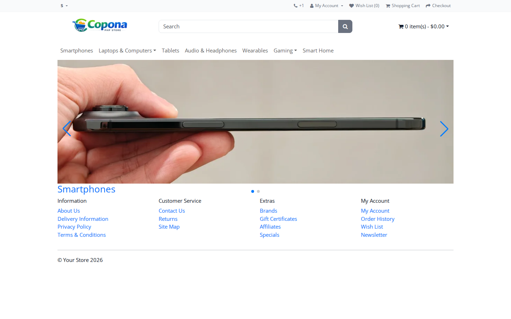
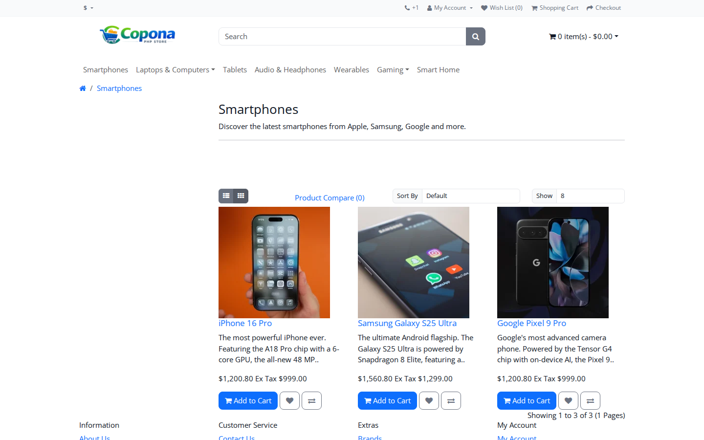
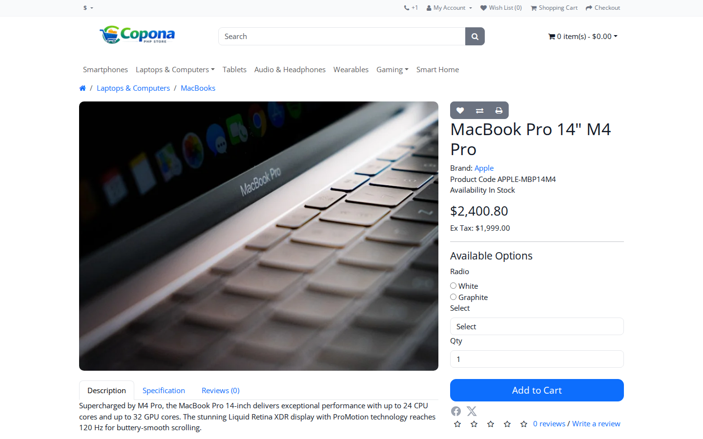
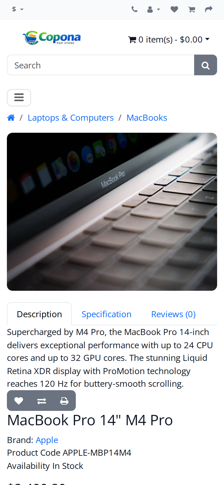
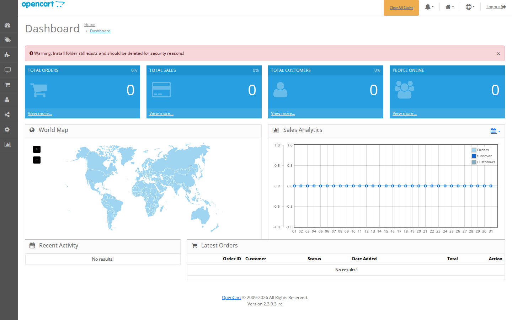

# Copona

[](https://github.com/copona/copona/actions/workflows/ci.yml)

[](LICENSE)

**A modern, open-source PHP e-commerce platform.** Copona started as a fork of
[OpenCart](https://www.opencart.com) and has been rebuilt on a current stack:
if you like OpenCart's simplicity but not its age, this is for you.



## Why Copona

| | Copona | OpenCart 3 | WooCommerce |
|---|---|---|---|
| PHP | 8.3+ | 7.x–8.x | 7.4+ (via WordPress) |
| Front-end | Bootstrap 5, Vite + SCSS build | Bootstrap 3 | theme-dependent |
| Admin editor | Tiptap + CodeMirror source view | Summernote | Gutenberg |
| Database layer | Laravel 12 Eloquent/Query Builder alongside the classic models | custom | WordPress `$wpdb` |
| Migrations | Phinx | none (manual SQL) | plugin-specific |
| SEO out of the box | JSON-LD (Product, Offer, Rating, Breadcrumbs, WebSite), Open Graph, canonical URLs, sitemap | basic meta | plugin needed |
| Images | auto WebP thumbnails, lazy loading | JPEG/PNG only | plugin needed |
| Install | `php copona install` or Docker | web wizard | WordPress + plugin |
| Needs WordPress | no | no | yes |

**Also included:** multi-store, multi-currency, guest checkout, coupons/vouchers/rewards,
reviews, wishlist and compare, an admin bar on the storefront with one-click
"edit this product/category/page" links, and two themes (`default` and `simplica`).

## Screenshots

| Category | Product | Mobile |
|---|---|---|
|  |  |  |



<sub>Screenshots are generated from the demo data by the
[Screenshots workflow](.github/workflows/screenshots.yml).</sub>

## Try the demo in 2 minutes

You need Docker. This starts a store with 15 demo products (phones, laptops,
audio, gaming…) in 11 categories:

```bash
git clone https://github.com/copona/copona.git && cd copona
docker compose up -d --build
sleep 15   # let MariaDB start
docker exec -w /app copona-web-1 composer install --no-interaction
docker exec -u application copona-web-1 php /app/copona install --no-interaction
```

- Storefront: http://localhost:8080
- Admin: http://localhost:8080/admin (user `admin`, password `admin123`)

Copona is under active development. Please try it and post issues, bugs, or
**feature requests** at https://github.com/copona/copona/issues. We're happy to help!

## Requirements
* MySQL >= 5.6
* PHP >= 8.3
* Composer [https://getcomposer.org/](https://getcomposer.org/)

## Get started
`composer create-project copona/copona`

`cd copona && php copona install`

## Installation
* Getting project files
    * With Git (recommended)
        * Install Git [guide](http://rogerdudler.github.io/git-guide)
        * Install Composer [guide](https://getcomposer.org/doc/01-basic-usage.md#installing-dependencies)
        * Navigate to your webroot, for example:
            * `cd /var/www/public_html`
        * `git clone https://github.com/Copona/copona.git .`
        * `git config user.name "Your Name"`
        * `git config user.email youremail@yourdomain.org`
        * `git config core.fileMode false`
        * `composer install`
        * Open the installer at `http://domain/install`
    * Using manual download:
        * [Click here to download the master branch](https://github.com/copona/copona/archive/master.zip)
* Prepared environment
    * With Docker
        * Install [Docker](https://docs.docker.com/engine/installation/) and [Docker Compose](https://docs.docker.com/compose/install/)
        * Do **not** create `.env` by hand — the installer generates it, and its own "is this installed?" check just looks for `.env`, so a pre-existing one makes it skip setup and leave the database empty.
        * Execute `docker compose up -d --build`
        * Wait for MariaDB to finish starting (a few seconds), then run:
            * `docker exec -w /app <web-container> composer install --no-interaction`
            * `docker exec -u application <web-container> php /app/copona install --no-interaction`
        * The install command reads its DB/admin settings from the environment variables already set in `docker-compose.yml` (`DB_DRIVER`, `DB_HOSTNAME`, `DB_DATABASE`, `ADMIN_USERNAME`, etc.) and creates `.env`, the database schema, and runs migrations for you.
    * Manual install
        * Install a web server: Apache, IIS, etc.
        * Install PHP and MySQL
        * Install Composer [https://getcomposer.org/](https://getcomposer.org/)
        * From the command prompt, execute:
            * `composer install`
            * `php copona install` (interactive) — asks for DB/admin details, creates `.env`, and runs migrations
* Navigate to your web address: `http://domain-OR-IPaddress/` or `http://domain-OR-IPaddress/subfolder-where-you-cloned`
* If all requirements have been met, fill in the form and enjoy!

## Update
* If you installed Copona with Git (recommended), go to the folder where Copona is installed:
  * If you have not edited any files locally:
    * `git pull`
  * If you have edited files locally — you are a developer, you will know what to do!
  * Check the site; if there are problems, post them online, or you can always revert to the previous version.
* Run Composer install:
  * `composer install`
* Run database migration:
  * `php vendor/bin/phinx migrate` (https://github.com/copona/copona/wiki/Migration-Phinx)


## TODO

* Put into migrations:

```sql
ALTER TABLE `cp_url_alias`
ADD INDEX `query_language_id` (`query`, `language_id`);
```
